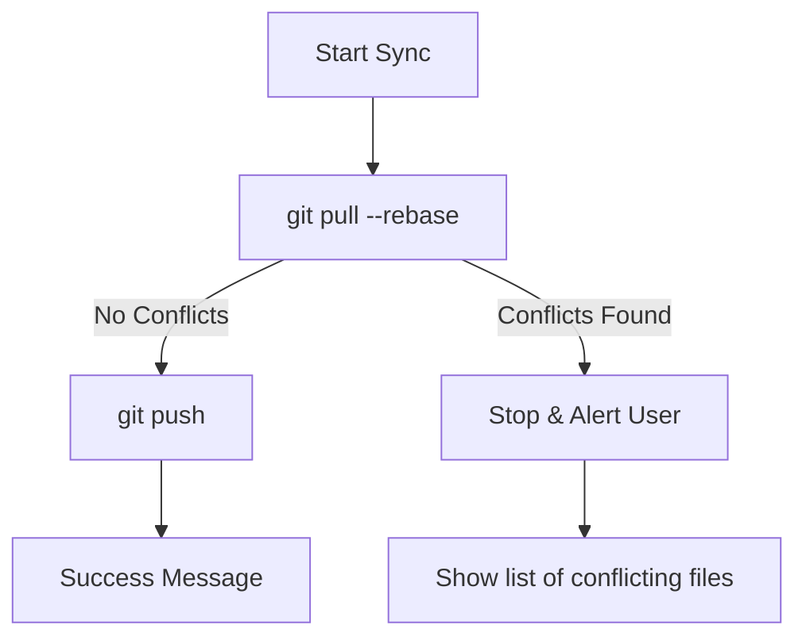

# Software Development Documentation

## Requirements

The **Git Snapshot ("SavePoint")** tool is an excellent project for mastering TypeScript and Node's interaction with the system. Because this tool interacts with a user's source code, the requirements must focus on **automation, speed, and safety**.

Here are the requirements for building **`snap`** (or whatever you choose to name it):

---

### 1. Functional Requirements (The "What")

These define the core commands your CLI must handle.

* **`snap <message>` (The Save Point):**
* Automatically stage all changes (`git add .`).
* Create a commit with a timestamp-prefixed message (e.g., `[Snap 14:20] fix: header alignment`).
* Attempt to `push` to the current branch automatically.


* **`snap undo` (The Rollback):**
* Reset the last commit while keeping the file changes (soft reset).
* Unstage the files so the user can fix their "mistake."


* **`snap sync` (The Catch-up):**
* Perform a `git pull --rebase` to get latest changes.
* If successful, automatically `git push`.


* **`snap list` (The Timeline):**
* Show a formatted list of the last 5 "snaps" (commits) with relative time (e.g., "5 minutes ago").


### 2. Technical Requirements (The "How")

* **Environment:** Node.js runtime with TypeScript.
* **Git Integration:** Use the `simple-git` library to interface with the system's Git installation rather than writing raw shell strings.
* **State Management:** The tool must detect if the current directory is a Git repository before running.
* **Configuration:** A way to toggle "Auto-push" on or off (perhaps via a `.snaprc` file or a flag like `--no-push`).

### 3. Safety & Error Handling (Crucial)

Since this tool modifies code, it needs guardrails:

* **Conflict Detection:** If `snap sync` encounters a merge conflict, the tool must stop, alert the user, and point them to the files that need fixing.
* **Empty Change Check:** If there are no changes to save, the tool should notify the user instead of creating an empty commit.
* **Pre-flight Check:** Ensure `git` is installed on the user's machine before initializing.

### 4. User Experience (UX) Requirements

* **Visual Feedback:** Use `chalk` to color-code output:
* **Green** for successful saves.
* **Red** for Git errors.
* **Yellow** for warnings (e.g., "You have unpushed commits").


* **Spinners:** Use `ora` to show a loading spinner while the network request (pushing/pulling) is happening.
* **Help Menu:** A clear `--help` flag explaining every command.

---

### Suggested Technical Stack

| Category | Library |
| --- | --- |
| **Command Parsing** | `commander` |
| **Git Operations** | `simple-git` |
| **Styling** | `chalk` |
| **Spinners** | `ora` |
| **Date Formatting** | `date-fns` (for the "5 mins ago" logic) |

---

### Data Flow Example: `snap "fixed bug"`

1. **Check:** Is it a git repo? (If no, exit with error).
2. **Check:** Are there changes? (If no, exit with "Nothing to save").
3. **Action:** Run `git add .`.
4. **Action:** Run `git commit -m "[Snap] fixed bug"`.
5. **Action:** Run `git push origin [current-branch]`.
6. **Feedback:** Print "🚀 Save point created and pushed!"


## Design Phase
To build this tool effectively, we need to design the **Logic Flow** for each command. This ensures that the TypeScript code handles the edge cases (like network errors or merge conflicts) before they break the user's repository.

---

### 1. `snap <message>` (The Automation Logic)

This is the "happy path" that replaces three manual Git commands with one.

| Step | Action | Logic / Condition |
| --- | --- | --- |
| **1. Validation** | Check Repo | If `.git` doesn't exist, throw error and exit. |
| **2. Staging** | `git add .` | Stage all tracked and untracked files. |
| **3. Commit** | `git commit` | Prefix message: `[Snap YYYY-MM-DD HH:mm] <User Message>`. |
| **4. Push** | `git push` | Identify current branch and push to `origin`. |
| **5. Cleanup** | UI Feedback | Show a "Success" checkmark using `chalk.green`. |

---

### 2. `snap undo` (The Safety Design)

The goal here is a "Soft Reset." We want to delete the commit but **keep the code changes** so the user doesn't lose work.

* **Command:** `git reset --soft HEAD~1`
* **Logic:**
1. Check if the last commit was a "Snap" commit (optional but safer).
2. Execute the soft reset.
3. **Unstage files:** Run `git reset HEAD` so the files appear as "modified" again.
4. **Notify:** Inform the user: *"Last snap undone. Your changes are preserved in the working directory."*


---

### 3. `snap sync` (The Conflict-Aware Logic)

This is the most complex design because it involves network interaction and potential code conflicts.



* **Design Note:** We use `--rebase` to keep the history linear. If a conflict occurs, the CLI must exit immediately and tell the user to resolve it manually in their IDE.

---

### 4. `snap list` (The UI/Display Design)

Since the terminal is text-based, we need a clean way to present the history.

* **Data Source:** `git log -n 5 --pretty=format:"%h|%cr|%s"`
* **Transformation:** Parse the string into an array of objects.
* **Output Table:**
| Hash | Age | Message |
| :--- | :--- | :--- |
| `a1b2c3d` | 2 mins ago | [Snap] fixed the login button |
| `e5f6g7h` | 1 hour ago | [Snap] added styling to footer |

---

### 5. Technical System Architecture

Your file structure should be modular so it's easy to test and expand.

```text
my-cli/
├── src/
│   ├── commands/
│   │   ├── snap.ts      // Logic for saving
│   │   ├── undo.ts      // Logic for rolling back
│   │   └── sync.ts      // Logic for pulling/pushing
│   ├── utils/
│   │   ├── git-check.ts // Verify if git is installed/init
│   │   └── logger.ts    // Chalk wrappers for colors
│   └── index.ts         // Entry point (Commander setup)
├── package.json
└── tsconfig.json

```
To build a professional-grade CLI like **Snap**, the design must move beyond simple scripts into a structured system architecture. Here is the design breakdown for the Technical, Safety, and UX requirements.

---

### 2. Technical Architecture Design

The app should follow a **Modular Pattern**. This separates the "CLI interface" (what the user types) from the "Git Engine" (what the code does).

* **The Git Wrapper (Abstraction):** Instead of calling raw shell commands, create a `GitService` class. This makes the code testable and keeps your business logic clean.
* **Provider Pattern:**
* `src/services/git.service.ts`: Handles `simple-git` calls.
* `src/ui/renderer.ts`: Handles all `chalk` and `ora` logic.


* **State Management:** Since the CLI is short-lived (runs and exits), "state" is determined by the filesystem. The app must query the `.git` folder at startup to build its internal state.

---

### 3. Safety & Error Handling Design

Safety is the most critical part of a tool that modifies a user's source code.

| Scenario | Logic / Guardrail | Result |
| --- | --- | --- |
| **No Git Repo** | Check for `.git` folder using `git.checkIsRepo()`. | Exit with error: "Not a git repository." |
| **Merge Conflict** | Capture error code from `git pull --rebase`. | Stop execution, list files with `<<<< HEAD`, and provide a link to a "How to resolve" guide. |
| **Empty Changes** | Run `git status --porcelain`. If output is empty... | Print: "Working tree clean. Nothing to snap." |
| **Network Failure** | Wrap `git push` in a `try/catch` block. | Inform user: "Save point created locally, but cloud push failed. Check your internet." |
| **Interrupted Process** | Handle `SIGINT` (Ctrl+C). | Ensure the app doesn't leave the Git index in a locked state (`.git/index.lock`). |

> **Pro Tip:** Always use a **Dry Run** logic for destructive commands like `undo`. Before executing the reset, verify the last commit message contains the `[Snap]` prefix to ensure the user isn't accidentally deleting a manual, high-value commit.

---

### 4. UX & Interface Design

A CLI's "UI" is its typography, colors, and layout.

* **The "At-a-glance" Status:** Use a consistent color palette:
* **Blue (`info`):** General status updates.
* **Green (`success`):** Completed commits and pushes.
* **Yellow (`warning`):** Non-critical issues (e.g., "3 commits ahead of origin").
* **Red (`error`):** Terminal failures.


* **Progressive Disclosure:** Don't dump 50 lines of Git logs. Use a spinner for background tasks (like pushing) and only show details if the user adds a `--verbose` flag.
* **Interactive Prompts:** If a user runs `snap` without a message, don't error out. Use `inquirer` to pop up an interactive text input: *"What did you work on? [__________]"*.

---

### Summary of the Design System

```typescript
// Example of the Safety Guardrail Logic
async function safeSnap(message: string) {
  const isRepo = await git.checkIsRepo();
  if (!isRepo) throw new Error("Initialize git first!");

  const status = await git.status();
  if (status.isClean()) {
    console.log(chalk.yellow("⚠ Everything is up to date."));
    return;
  }

  const spinner = ora("Creating save point...").start();
  try {
    await git.add(".");
    await git.commit(`[Snap] ${message}`);
    spinner.succeed(chalk.green("Snapshot saved locally."));
  } catch (err) {
    spinner.fail(chalk.red("Failed to save snapshot."));
    // Error handling logic here
  }
}

```

---
